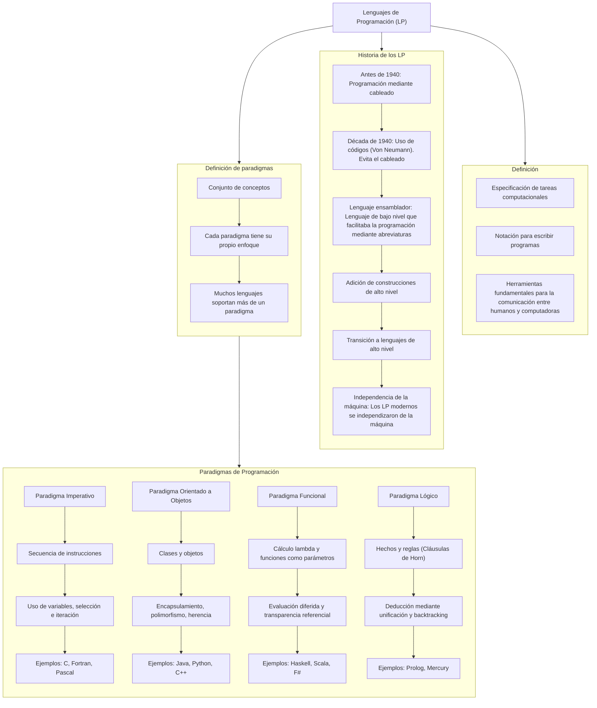

# TP 1

# Características de los Lenguajes de Programación

## Resumen: Introducción a los Lenguajes de Programación

### ¿Qué son los Lenguajes de Programación (LP)?

Los LP son herramientas fundamentales para la comunicación entre humanos y computadoras. Actúan como una notación específica que permite escribir programas, es decir, la especificación detallada de una tarea que una computadora debe ejecutar.

### Historia de los LP: Una Evolución hacia la Abstracción

- Inicios: La programación inicial se realizaba mediante cableado físico.
-  Década de 1940: La introducción de códigos (Von Neumann) marcó un avance significativo, evitando el engorroso cableado.
- Lenguaje Ensamblador: Surgió como una forma de facilitar la programación mediante abreviaturas nemotécnicas para las instrucciones y las direcciones de memoria. Sin embargo, seguía siendo un lenguaje de bajo nivel, dependiente de la arquitectura de la computadora y difícil de comprender.
- Hacia la Abstracción: Se incorporaron construcciones de mayor nivel como la asignación de valores, los bucles y las sentencias condicionales.
- Reflejo Inicial de la Arquitectura Von Neumann: Los primeros lenguajes reflejaban la arquitectura de Von Neumann, con una memoria unificada para datos y programas, y una unidad de procesamiento secuencial.
- Transición a Lenguajes de Alto Nivel: Los LP modernos se independizaron de la máquina, permitiendo describir el procesamiento de manera general, sin detallar cada instrucción a nivel de hardware.

### Lenguajes de Bajo Nivel en la Actualidad:

Aunque los lenguajes de alto nivel son predominantes, los lenguajes de bajo nivel como Assembler y Web Assembly aún tienen su utilidad en casos específicos donde el control a nivel de hardware o la eficiencia son críticos.
Paradigmas de Programación: Diferentes Enfoques para Resolver Problemas
Los paradigmas de programación ofrecen diferentes estilos y filosofías para abordar la creación de programas:
- Imperativo: Se centra en describir una secuencia de instrucciones que modifican el estado del programa. Ejemplos de construcciones clave son las variables, la secuencia de instrucciones, la selección (condicionales) y la iteración (bucles).
- Orientado a Objetos (OO): Organiza el código en torno a "objetos", que son instancias de "clases". Conceptos fundamentales incluyen la invocación de métodos, el encapsulamiento (ocultar el estado interno), el polimorfismo (objetos que pueden tomar muchas formas) y la herencia (creación de nuevas clases basadas en existentes).
- Funcional: Se basa en el concepto matemático de funciones. Características importantes son la composición de funciones, el cálculo lambda (funciones anónimas), la transparencia referencial (el resultado de una función depende solo de sus argumentos), la evaluación diferida (cálculos solo cuando son necesarios) y el tratamiento de las funciones como parámetros.
- Este resumen proporciona una visión general de la introducción a los lenguajes de programación, abarcando su definición, evolución histórica, la persistencia de los lenguajes de bajo nivel y los principales paradigmas que moldean la forma en que escribimos software hoy en día.

