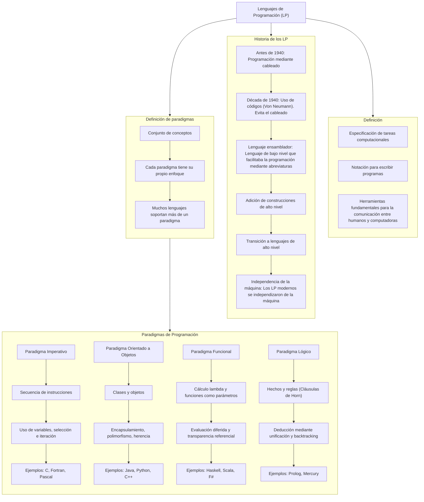

# TP 1

# Características de los Lenguajes de Programación

### Mapa conceptual de Lenguajes de Programación

```mermaid
flowchart TD

subgraph DEF["Definición"]
    direction LR
    C["Especificación de tareas computacionales"]
    D["Notación para escribir programas"]
    E["Herramientas fundamentales para la comunicación entre humanos y computadoras"]
end

subgraph HLP["Historia de los LP"]
    direction TB
    H1["Antes de 1940: Programación mediante cableado"] --> H3["Década de 1940: Uso de códigos (Von Neumann). Evita el cableado"]
    H3 --> H4["Lenguaje ensamblador: Lenguaje de bajo nivel que facilitaba la programación mediante abreviaturas"]
    H4 --> H5["Adición de construcciones de alto nivel"]
    H5 --> H6["Transición a lenguajes de alto nivel"]
    H6 --> H7["Independencia de la máquina: Los LP modernos se independizaron de la máquina"]
end

subgraph DDP["Definición de paradigmas"]
    direction TB
    DP1["Conjunto de conceptos"] --> DP2["Cada paradigma tiene su propio enfoque"] --> DP3["Muchos lenguajes soportan más de un paradigma"]
end

subgraph PDP["Paradigmas de Programación"]
    direction TB
    P1["Paradigma Imperativo"] --> PI1["Secuencia de instrucciones"]
    PI1 --> PI2["Uso de variables, selección e iteración"] --> PI3["Ejemplos: C, Fortran, Pascal"]

    P2["Paradigma Orientado a Objetos"] --> POO1["Clases y objetos"]
    POO1 --> POO2["Encapsulamiento, polimorfismo, herencia"] --> POO3["Ejemplos: Java, Python, C++"]

    P3["Paradigma Funcional"] --> PF1["Cálculo lambda y funciones como parámetros"]
    PF1 --> PF2["Evaluación diferida y transparencia referencial"] --> PF3["Ejemplos: Haskell, Scala, F#"]

    P4["Paradigma Lógico"] --> PL1["Hechos y reglas (Cláusulas de Horn)"]
    PL1 --> PL2["Deducción mediante unificación y backtracking"] --> PL3["Ejemplos: Prolog, Mercury"]
end

LP["Lenguajes de Programación (LP)"] --> DEF
LP --> HLP
LP --> DDP
DDP --> PDP
```
