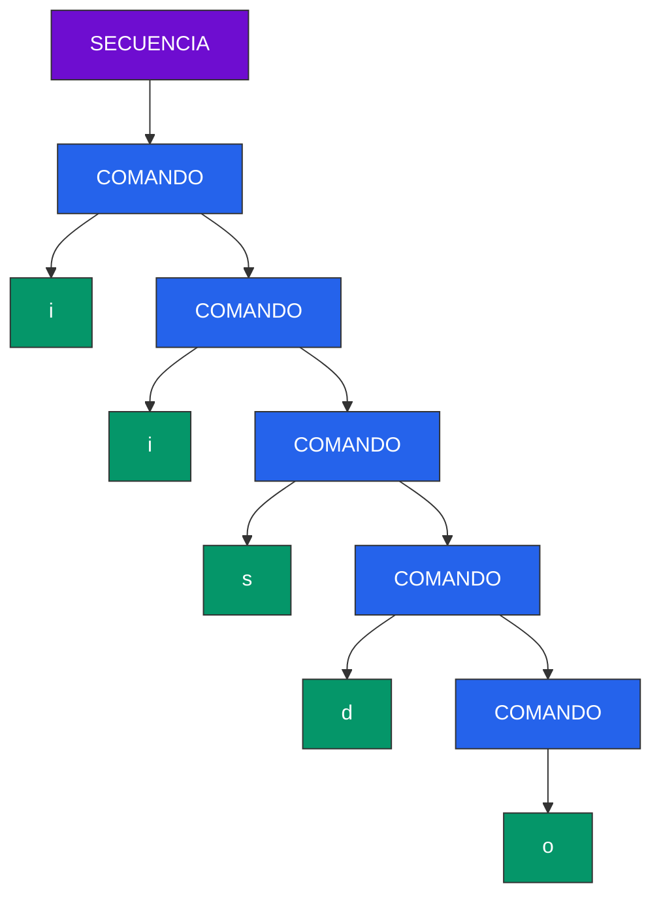

## Trabajo Práctico N°4

### Realizar el árbol de analisis sintáctico y el diagrama de sintactico para el lenguaje Deadfish

### GIC

```gic
S -> C
C -> iC | dC | sC | oC | i | d | s | o 
```

### Árbol de análisis sintáctico

El siguiente árbol de análisis sintáctico representa la secuencia de comandos del lenguaje Deadfish para la cadena `iisdo`:



### Diagrama de análisis sintáctico CONWAY

