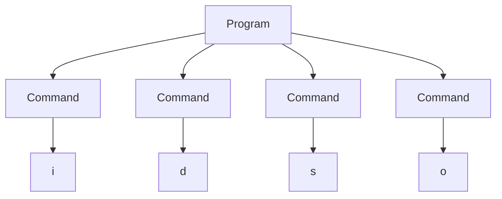

## Trabajo Práctico N°4

### Realizar el árbol de analisis sintáctico y el diagrama de sintactico para el lenguaje Deadfish

### Árbol de análisis sintáctico

```mermaid

graph TD
    A[Program] --> B[Command]
    A --> C[Command]
    A --> D[Command]
    A --> E[Command]
    B --> F[i]
    C --> G[d]
    D --> H[s]
    E --> I[o]
```

### Diagrama de sintaxis

```mermaid
graph TD
    A[Program] --> B[Command]
    A --> C[Command]
    A --> D[Command]
    A --> E[Command]
    B --> F[i]
    C --> G[d]
    D --> H[s]
    E --> I[o]
```

